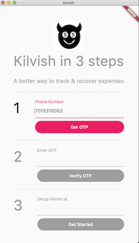
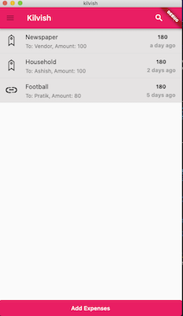
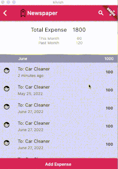

# kilvish

An app to better manage & track your expenses. 

- You can create your own tags & tag expenses to get a total value at monthly basis
- You can share the tag with your family member to track shared expenses to avoid double paying. Like paying to newspaper vendor 
- Your family member can add expenses to tags (like household) so that you can aggregate & track expense against the tag
- You can recover a shared expense by logging it to Kilvish, create a url & sharing it with a friend who can then pay on the url. 

More details at [kilvish.in](https://kilvish.in)

## Getting Started

1. Setup Flutter on your PC
   - [Download flutter](https://docs.flutter.dev/get-started/install)
   - [Setup Editor](https://docs.flutter.dev/get-started/editor?tab=vscode)
   - Run `flutter doctor` in your PC terminal to figure out anything that flutter needs that is not installed on your PC.
2. Run code
   - Run `git clone https://github.com/tamraj-kilvish/kilvish.git` in your PC terminal to clone the repository.
   - Navigate to the directory of the cloned repository in your PC terminal.
   - `flutter pub get` to install dependencies. Your editor will do it by default once you have cloned the repository & opened it in the editor.
   - `flutter run` will launch the app in debug mode. You can also launch it from Run command of your editor.

## Current app screenshots

|         **Signup Screen**          |        **Home Screen**           |         **Detail Screen**        |
|------------------------------------|----------------------------------|----------------------------------|
|  |  ||

What we aiming to achieve (in high resolution) [here](https://app.moqups.com/4J1cgkPSrhVkHQJhlKViEu4fKGFXatNp/view/page/ae8fe8eb0?ui=0&fit_width=1)

## Notes during development

We will be putting resources that we referred for someone new to figure out why & how we are doing what, while we build Kilvish

**Signup Page**
- [Learning Layout](https://docs.flutter.dev/development/ui/layout)
- [Learning about Forms](https://docs.flutter.dev/cookbook/forms)

**Package code check**
- [Dart Flutter Package Analyzer](https://github.com/marketplace/actions/dart-flutter-package-analyzer)

**Home Screen**
 - [List View without card & spaces](https://codesinsider.com/flutter-listview-example/#ListViewseparated)
 - [Time days in past from now](https://stackoverflow.com/questions/61682959/the-date-of-yesterday-in-flutter)
 - [show relative dates in past like x days ago](https://pub.dev/packages/jiffy#relative-time)

**Detail Screen**
 - Some complex scrolling/rendering through Sliver [SliverList, SliverappBar & SliverPersistentHeader](https://medium.com/flutter/slivers-demystified-6ff68ab0296f)
 - To update monthly aggregate, had to decide between [VisibilityDetector](https://stackoverflow.com/questions/63573632/how-to-get-the-index-number-on-scroll-for-listview-in-flutter) & [ScrollView offset approach](https://github.com/flutter/flutter/issues/19941). Chose latter as it would have less event firing so less chances to slow the UI down
 - To update the monthly aggregate widget only with scroll, instead of Stateful widget, found Notifier/Listenable pattern [here](https://api.flutter.dev/flutter/widgets/ValueListenableBuilder-class.html) and implemented the same

## Like to contribute ?

We are currently creating screens with hardcoded data. We intend to keep the repository 'always open'. So you can showcase your contribution to potential future employers. The app is developed in Flutter & we are all new to Flutter. But we do pretty intense code reviews. If you look to pick Flutter or knows decent bit of Flutter & would like to contribute, you can join our discord channel from this [Link](https://discord.gg/fhW8AgR9) or simply raise a PR. 

P.S. We are avoiding a lot of early refactor to keep us agile & be impactful. So we will avoid a lot of early/pre-mature refactoring. 
