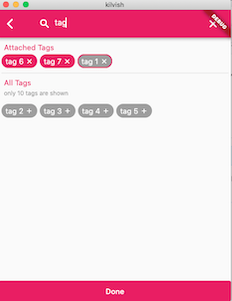
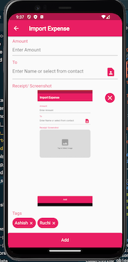

# kilvish

An app to better manage & track your expenses.

- You can create your own tags & tag expenses to get a total value at monthly basis
- You can share the tag with your family member to track shared expenses to avoid double paying. Like paying to newspaper vendor
- Your family member can add expenses to tags (like household) so that you can aggregate & track expense against the tag
- You can recover a shared expense by logging it to Kilvish, create a url & sharing it with a friend who can then pay on the url.

More details at [kilvish.in](https://kilvish.in)

## Getting Started

1. Setup Flutter on your PC
   - [Download flutter](https://docs.flutter.dev/get-started/install)
   - [Setup Editor](https://docs.flutter.dev/get-started/editor?tab=vscode)
   - Run `flutter doctor` in your PC terminal to figure out anything that flutter needs that is not installed on your PC.
2. Run code (currently broken .. read Android Development steps)
   - Run `git clone https://github.com/tamraj-kilvish/kilvish.git` in your PC terminal to clone the repository.
   - Navigate to the directory of the cloned repository in your PC terminal.
   - `flutter pub get` to install dependencies.
   - `flutter run` will launch the app in debug mode.
   - Your editor might have inbuilt capacity to run `flutter run` and `flutter pub get`. Eg. Visual Studio runs the app with Run command if you have the flutter extension installed.
3. Android Deployment
   - Due to sharing related changes, android & iOS specific code is written which had broken the web or MacOS builds.
   - `flutter build apk --debug && flutter install --debug` will build & install apk in an already running emulator
     - To run an Android emulator, install Android Studio & launch an emulator with the AVD manager
   - To make it easier to launch emulator every time, add `/path/to/sdk/emulator` to PATH variable & run command `emulator -avd <name of emulator>`
     - you can find SDK path from Android Studio -> Settings -> Appearance & Behavior -> Android SDK
     - To give a short name to the emulator, launch AVD manager from Android Studio, click on the pencil/edit button of the emulator & give it a short name that you can pass to the emulator command above.

## Firebase Setup

- Install [Firebase CLI](https://firebase.google.com/docs/cli?hl=en&authuser=0#install_the_firebase_cli) & login with `firebase login` on CLI
- Install FlutterFire CLI `dart pub global activate flutterfire_cli`
- Install Firebase Functions dependencies by doing `npm install` inside functions directory.
- Firebase functions are written in Typescript. Run `npm run build:watch` inside functions directory & it will listen for any changes in typescript, compile & update the respective javascript files. Leave it running.
- Launch emulator by running `firebase emulators:start` from the main directory. Access `http://127.0.0.1:5001/kilvish-aa125/us-central1/helloWorld` on the browser to check everything is working.

## Current app screenshots

| **Signup Screen**                  | **Home Screen**                  | **Detail Screen**                  |
| ---------------------------------- | -------------------------------- | ---------------------------------- |
|  |  |  |

| **Tags Screen**                           | **Import Expense Screen**                           |
| ----------------------------------------- | --------------------------------------------------- |
|  |  |

What we aiming to achieve (in high resolution) [here](https://app.moqups.com/4J1cgkPSrhVkHQJhlKViEu4fKGFXatNp/view/page/ae8fe8eb0?ui=0&fit_width=1)

## Notes during development

We will be putting resources that we referred for someone new to figure out why & how we are doing what, while we build Kilvish

**Signup Page**

- [Learning Layout](https://docs.flutter.dev/development/ui/layout)
- [Learning about Forms](https://docs.flutter.dev/cookbook/forms)

**Package code check**

- [Dart Flutter Package Analyzer](https://github.com/marketplace/actions/dart-flutter-package-analyzer)

**Home Screen**

- [List View without card & spaces](https://codesinsider.com/flutter-listview-example/#ListViewseparated)
- [Time days in past from now](https://stackoverflow.com/questions/61682959/the-date-of-yesterday-in-flutter)
- [show relative dates in past like x days ago](https://pub.dev/packages/jiffy#relative-time)

**Detail Screen**

- Some complex scrolling/rendering through Sliver [SliverList, SliverappBar & SliverPersistentHeader](https://medium.com/flutter/slivers-demystified-6ff68ab0296f)
- To update monthly aggregate, had to decide between [VisibilityDetector](https://stackoverflow.com/questions/63573632/how-to-get-the-index-number-on-scroll-for-listview-in-flutter) & [ScrollView offset approach](https://github.com/flutter/flutter/issues/19941). Chose latter as it would have less event firing so less chances to slow the UI down
- To update the monthly aggregate widget only with scroll, instead of Stateful widget, found Notifier/Listenable pattern [here](https://api.flutter.dev/flutter/widgets/ValueListenableBuilder-class.html) and implemented the same

**Tag Screen**

- Snehal has created Tags from scratch which was a good starting point. Her blog post [here](https://medium.com/nonstopio/flutter-tags-7410bd6a5835)
- Aligning tags like `float:left` using Wrap [link](https://stackoverflow.com/questions/48051289/how-do-you-align-widgets-like-css-float-with-flutter-ui)
- Rendering tag content using `Richtext` [link](https://www.codegrepper.com/code-examples/javascript/flutter+text+and+suffix+icon+)

**Import Screen**

- contact picker [here](https://pub.dev/packages/fluttercontactpicker/example)
- for image picker [here](https://pub.dev/packages/image_picker)

## Like to contribute ?

We are currently creating screens with hardcoded data. We intend to keep the repository 'always open'. So you can showcase your contribution to potential future employers. The app is developed in Flutter & we are all new to Flutter. But we do pretty intense code reviews. If you look to pick Flutter or knows decent bit of Flutter & would like to contribute, you can join our discord channel from this [Link](https://discord.gg/fhW8AgR9) or simply raise a PR.

P.S. We are avoiding a lot of early refactor to keep us agile & be impactful. So we will avoid a lot of early/pre-mature refactoring.

**This project is tested with BrowserStack**
